# VBA Challenge

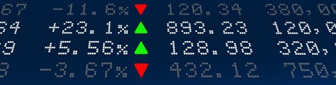

###### by Kurt Pessa

----------

# Table of Contents 
- [Setup](#setup)
- [Submission](#submission)
1. [Section 1: Processing Data](#section1)
2. [Section 2: Outputting to Summary Table](#section2)
3. [Section 3: Challenge](#section3)

----------

#### Setup 
[Back to Table of Contents](#toc)

1. Created a new repository `VBA-challenge` on GitHub with share-able link at [https://github.com/kpessa/VBA-challenge](https://github.com/kpessa/VBA-challenge)
2. Created a folder to correspond to the challenge called `VBAStocks`

#### Submission 
[Back to Table of Contents](#toc)

##### 1. Scripts (2) 

1.	**`Main.bas`**: Main VBA script 
	-	Includes these subroutines:
		-	**Sub Main()**: includes main script life cycle, loop through each worksheet
		-	**Sub Macro()**: main script logic, uses array to store data, also includes scripting to output to summary table, conditional formatting
		-	**Sub Macro_NotUsingArray()**: original script logic, processed data from worksheet.  *Not* used in final script.
		-	**Sub Challenge**(): script logic to process challenge section of exercise.
	-	Performance tweaks:
		-	**Sub EnablePerformance()**: uses performance tweaks, ie. disabling animation, screenupdating, and calculation turned to manual instead of automatic. 
		-	**Sub ResetPerformance()**: resets default application settings.
2.	**`StockClass.cls`**: Custom class module for `StockClass` attached as 

##### 2. Screenshots (3)

- 2016 screenshot attached as **`screenshot_2016.png`**

	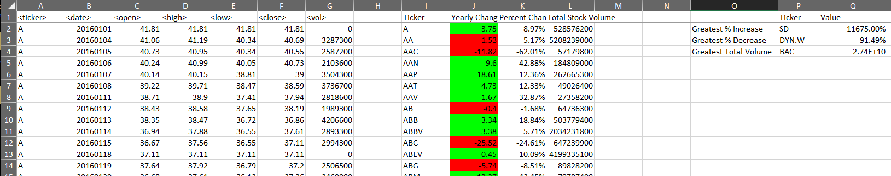

- 2015 screenshot attached as **`screenshot_2015.png`**

	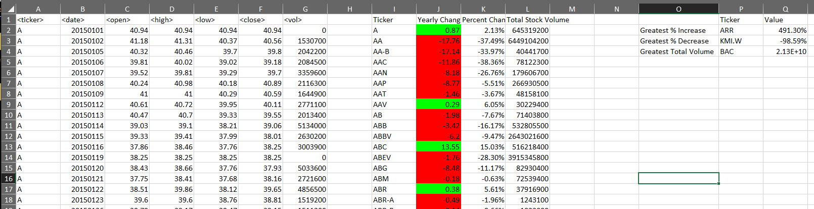

- 2014 screenshot attached as **`screenshot_2014.png`**

	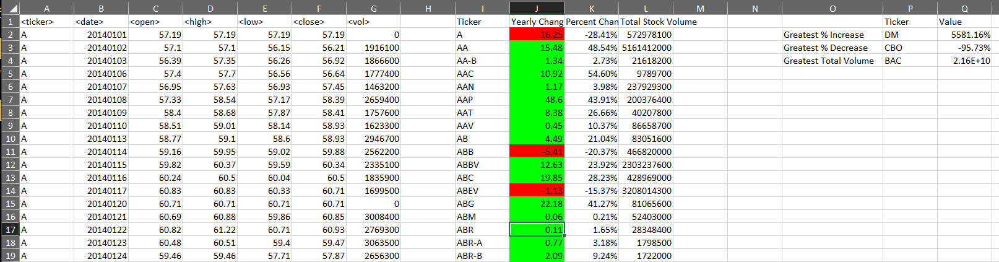

## Section 1: Processing Data 
[Back to Table of Contents](#toc)

##### Part 1: For Loop

- Created a script that will loop through all the stocks for one year ..

	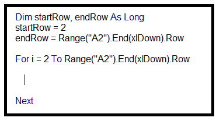
	
	-------------

	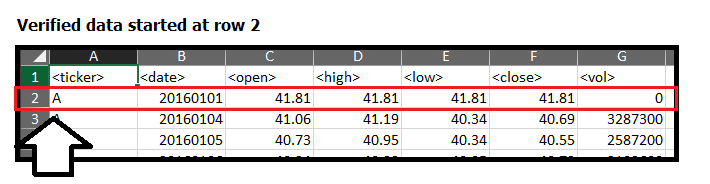
	
	-------------
	 
	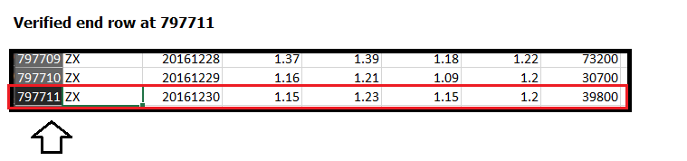
	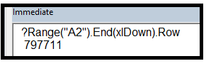
	-------------

##### Part 2: StockClass Class Module

-  kept track and outputted the following information to a summary table by creating a custom vba class called `Stock Class`
	1. `tickerSymbol` - the ticker symbol
	2. `yearlyChange` - yearly change from opening price at the beginning of the year to the closing price at the end of that year
	3. `percentChange` - the percent change from opening price at the beginning of a given year to the closing price at the end of that year
	4. `totalStock` - the total stock volume of the stock

	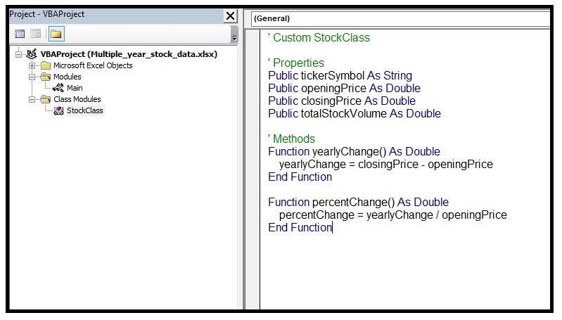

##### Part 3: Traversing through data logic

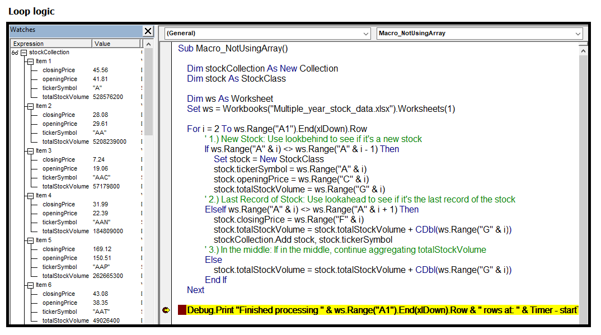

##### Part 4: Quality Assurance

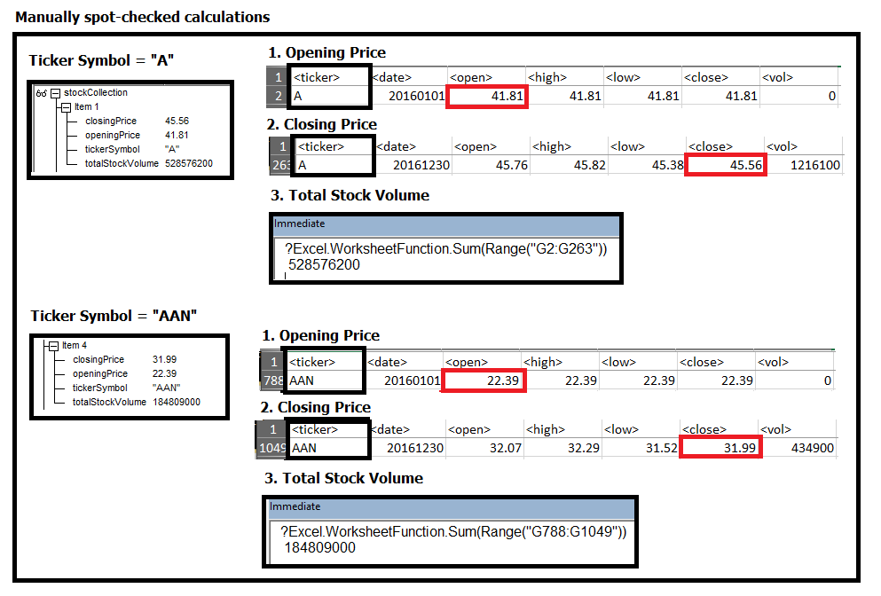

##### Part 5: Enhancing Performance

- Original macro took about 18.9 seconds to traverse through the 797,711 rows of stock data.

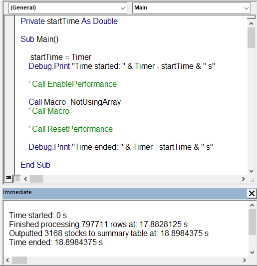	

- Took advice from "Excel Macro Mastery" .. [How to make your Excel VBA code run 1000 times faster.](https://www.youtube.com/watch?v=GCSF5tq7pZ0) 
- Decided to load data into an array before looping through. 
	- Brought processing time down from **~18.9 s to ~2.08 s. ~9 times faster.**  

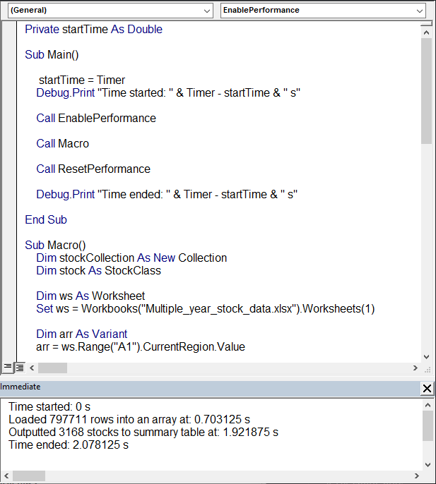
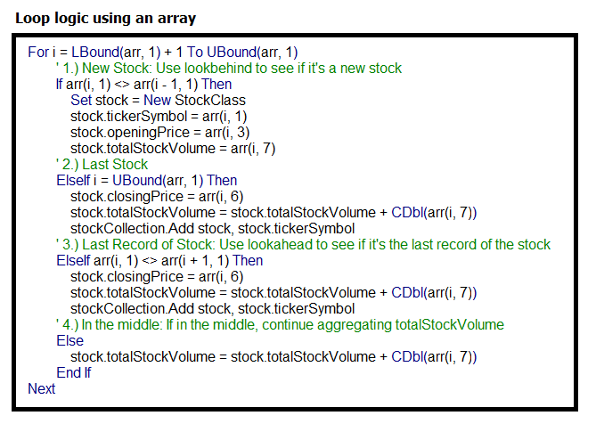
 
- Also, added a few performance enhancement tricks.

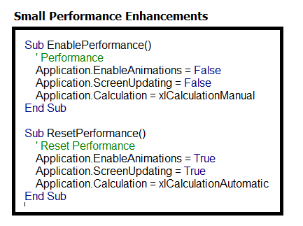

## Section 2: Outputting to Summary Table 
[Back to Table of Contents](#toc)
1. Writing header row
	
	- I became comfortable with setting Excel ranges in VBA with the same size array.
	- Wrote the header row in one step by setting the range "I1:L1" to an array with the header text. 

	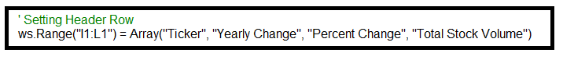

2. Changed the `Percent Change` column to percent format

	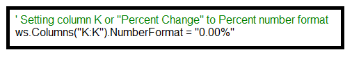

3. Looping through `stockCollection`

	

4. Writing values for each row

	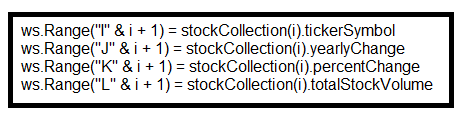

5. Conditional formatting that highlights positive change in green and negative change in red

	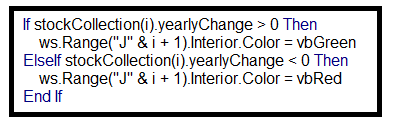

## Section 3: Challenge 
[Back to Table of Contents](#toc)
- Used built-in Excel functions `XLOOKUP` and `Max`/`Min` to find max min values and ticker symbols for 
	1.	`Greatest % increase`
	2.	`Greatest % decrease`
	3.	`Greatest Total Volume` 

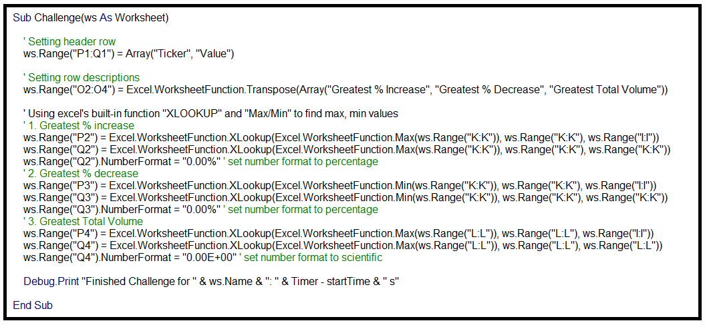