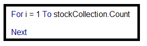

# VBA Challenge

###### by Kurt Pessa

----------

#### Setup

1. Created a new repository `VBA-challenge` on GitHub with share-able link at [https://github.com/kpessa/VBA-challenge](https://github.com/kpessa/VBA-challenge)
2. Created a folder to correspond to the challenge called `VBAStocks`

#### Submission

##### 1. Scripts (2)

-	Main VBA script attached as **`Main.bas`**
	-	Main Scripts:
		-	**Sub Main()**: includes main script life cycle, loop through each worksheet
		-	**Sub Macro()**: main script logic, uses array to store data, also includes scripting to output to summary table, conditional formatting
		-	**Sub Macro_NotUsingArray()**: original script logic, processed data from worksheet.  *Not* used in final script.
		-	**Sub Challenge**(): script logic to process challenge section of exercise.
	-	Performance tweaks:
		-	**Sub EnablePerformance()**: uses performance tweaks, ie. disabling animation, screenupdating, and calculation turned to manual instead of automatic. 
		-	**Sub ResetPerformance()**: resets default application settings.
-	Custom class module for `StockClass` attached as **`StockClass.cls`**

##### 2. Screenshots (2)

- 2016 screenshot attached as **`screenshot_2016.png`**

	

- 2015 screenshot attached as **`screenshot_2015.png`**

	

- 2014 screenshot attached as **`screenshot_2014.png`**

	

#### Section 1: For Loop

- Created a script that will loop through all the stocks for one year ..

	
	
	-------------

	
	
	-------------
	 
	
	
	-------------

#### Section 2: StockClass Class Module

-  kept track and outputted the following information to a summary table by creating a custom vba class called `Stock Class`
	1. `tickerSymbol` - the ticker symbol
	2. `yearlyChange` - yearly change from opening price at the beginning of the year to the closing price at the end of that year
	3. `percentChange` - the percent change from opening price at the beginning of a given year to the closing price at the end of that year
	4. `totalStock` - the total stock volume of the stock

	

#### Section 3: Traversing through data logic

#### Section 4: Quality Assurance

#### Section 5: Enhancing Performance

- Original macro took about 18.9 seconds to traverse through the 797,711 rows of stock data.

	

- Took advice from "Excel Macro Mastery" .. [How to make your Excel VBA code run 1000 times faster.](https://www.youtube.com/watch?v=GCSF5tq7pZ0) 
- Decided to load data into an array before looping through. 
	- Brought processing time down from **~18.9 s to ~2.08 s. ~9 times faster.**  

 
- Also, added a few performance enhancement tricks.

#### Section 2: Output Table

1. Writing header row
	
	- I became comfortable with setting Excel ranges in VBA with the same size array.
	- Wrote the header row in one step by setting the range "I1:L1" to an array with the header text. 

	

2. Changed the `Percent Change` column to percent format

	

3. Looping through `stockCollection`

	

4. Writing values for each row

	

5. Conditional formatting that highlights positive change in green and negative change in red

	

## Challenges

